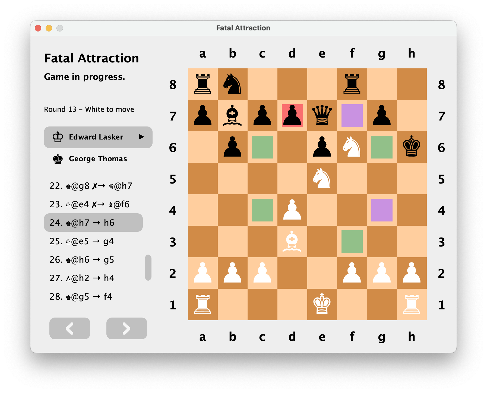
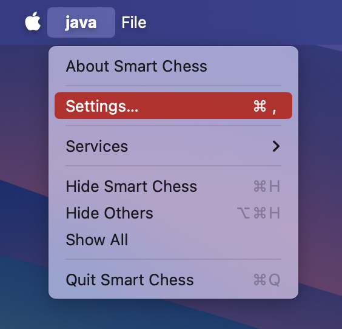

# ♟️ Smart Chess
This is a single/double-user desktop Chess game for Chess lovers or learners.
In addition to saving and loading Chess games, it also supports loading custom implementations of smart chess-playing agents to play against (it's really easy to implement). This may be of great interest to A.I. learners or practitioners.

## Inspiration
Being a Chess game lover and a beginner A.I. explorer myself, practice and hands-on experience is crucial. I feel like, with the help of this project, Chess lovers or learners and A.I. enthusiasts like me can have the very tool to learn, practice, and have fun with Chess and/or explore solving Chess with smart agents.

## Features
- Play against another human or any loaded agent (it comes with a basic Minimax algorithm with alpha-beta pruning and a search depth of 4).
- Easily save and load Chess games.
- User-friendly interface (especially for beginners).
- Review previous moves, undo, redo, and reset.
- Load external agents (see section below on how to implement yourself).
- More features are coming...



## How to use?
1. Download the latest jar file from [releases](https://github.com/4g3nt81lly/Smart-Chess/releases).
2. Double click to launch the application.
> **Note**  
> This application has only been tested on macOS and not Windows, please open an issue [here](https://github.com/4g3nt81lly/Smart-Chess/issues) if you've encountered any issue on Windows (or macOS).

### How to implement your own agent?
1. Download the latest API jar file from [releases](https://github.com/4g3nt81lly/Smart-Chess/releases).
2. Create a Java project, structure it however you like.
3. Add the jar file you just downloaded as a project library to your project.
4. Create a new Java class that extends `chess.model.player.Agent`.
5. In your class, add a `public` constructor of the signature:
`YourAgent(String, Color, int)`.
    > **Note**  
    This is mandatory and your constructor must strictly follow the above signature, otherwise your agent cannot be loaded from the application.
6. In your class, define your agent's decision-making logic by overriding the public method `getPlayerMove(Chessboard)`. The `Chessboard` class offers some methods that you may find helpful to inspect the game state.
7. As long as step 5 and 6 have been properly implemented, you are free to design your agent class however you like to get it working (e.g. adding methods and fields to maintain internal states).
8. Additionally, you may specify a custom display name for your agent. Simply annotate your agent class with `@AgentInfo(displayName = "...")`. If this is not specified, your agent class name will be used by default.

Here's an example implementation:
```java
import chess.model.Color;
import chess.model.Chessboard;
import chess.model.moves.Movement;
import chess.model.moves.Capture;
import chess.model.moves.PlayerMove;
import chess.model.player.Agent;
import chess.model.player.AgentInfo;

import java.util.Optional;

@AgentInfo(displayName = "My Agent")
public class MyAgent extends Agent {
    // REQUIRED: designated public constructor
    public MyAgent(String name, Color color, int score) {
        super(name, color, score)
    }
    
    // performs capture whenever possible, otherwise random moves
    @Override
    public PlayerMove getPlayerMove(Chessboard chessboard) {
        Optional<Movement> captureMove = chessboard.getAllLegalMoves(this).findFirst(movement -> {
            return movement instanceof Capture;
        });
        if (captureMove.isPresent()) {
            Capture capture = (Capture) captureMove.get();
            this.delay(1);
            return new PlayerMove(
                    capture.getInitialPosition(),
                    capture.getFinalPosition(),
                    this.color
            );
        }
        return super.getPlayerMove(chessboard);
    }
}
```
9. Once you're done, you have two options to have it loaded in the application 
   1. compile your agent classes in the same directory (i.e. your `.class` files in one directory);
   2. build a JAR artifact for your project containing the compile output of your agent class.
      > **Note**  
        You do _not_ need to include the extracted API jar in your jar file, include only the compile output of your agent class(es).

In addition, you can find details about using methods and how things work internally in the documentations provided in [releases](https://github.com/4g3nt81lly/Smart-Chess/releases) or [here](docs/index.html).

### How to load external agent(s)?
1. Open Smart Chess, go to `Settings…`:  
   
2. You have two options to load external agent(s).
   1. Load from JAR: select a jar file.
   2. Load from a directory: select a directory containing `.class` files.
3. When there are multiple agents detected, you will be prompted to select the ones you wish to load.

## To Dos
- [ ] Add the missing documentations.
- [ ] Add the missing test cases.
- [ ] Add support for adding a game description.
- [ ] Add support for Pawn Promotion.
- [ ] Board editing and creating puzzles.
- [ ] Add support for algebraic notations.
- [ ] Add support for other draw configurations.
- [ ] Add support for customizing externally-loaded agents.
- [ ] Suggest features...?

## Contributing
- 🍴&nbsp;Simply fork the code yourself and submit a pull request to improve this app!
- 🚩&nbsp;Open an [issue](https://github.com/4g3nt81lly/Smart-Chess/issues) or [discussion](https://github.com/4g3nt81lly/Smart-Chess/discussions) if you have questions, suggestions, or bugs you've found.
- 📧&ensp;Hit me up at my [E-mail](mailto:4g3nt81lly@gmail.com), [Facebook](https://www.facebook.com/billylby), or [Instagram](https://www.instagram.com/4g3nt81lly/) if you'd like to discuss or help with this project (or other projects), or even just chat with me or teach me about something!